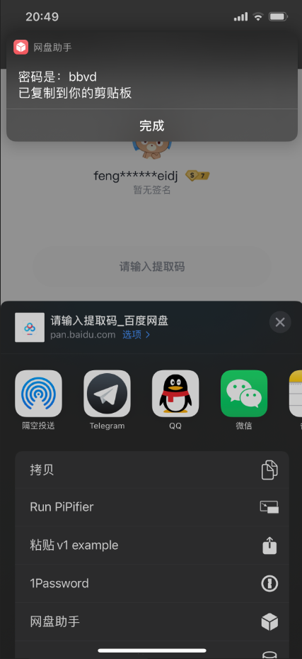

# 网盘助手快捷指令

适用于 `iOS` 的一个基于网盘助手API的网盘密码查询快捷指令

# 快捷指令

## 当前版本
2020.10.24.2

## 安装链接
https://www.icloud.com/shortcuts/14b0f4414a17414baee92a0be8bcc746

## 更新方式
在快捷指令中直接点击运行 `网盘助手` 指令来检查更新，如有更新点击好即可跳转到新的快捷指令，添加覆盖原有的即可

## 历史版本更新

## 2020.10.24.2
* 支持 检查更新

## 2020.10.24.1
* 支持 百度网盘
* 支持 蓝奏云
* 支持 微云

# 相关链接
- [Mitt](https://blog.mitt.fun) Myself
- [哩呵](https://www.newday.me/) (网盘助手作者)
- [网盘助手](https://pan.newday.me/?scene=one_index_index) 适用于电脑浏览器
